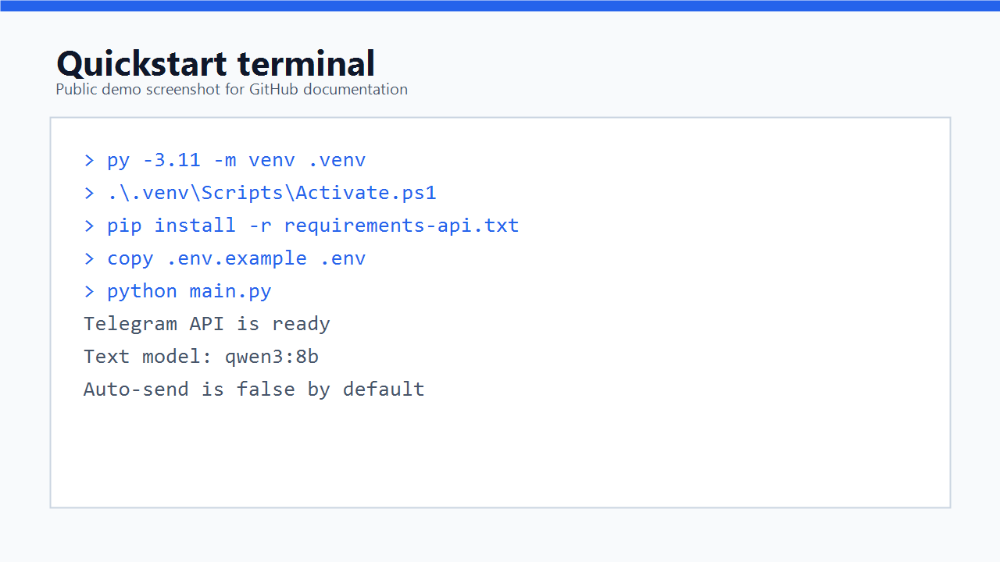
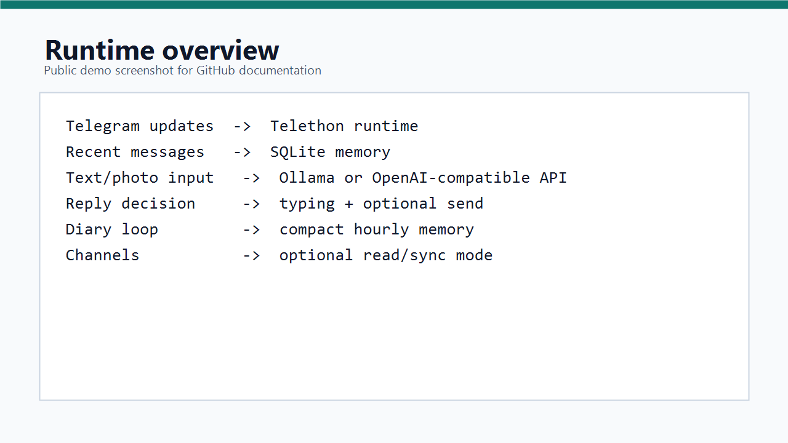

# Telegram AI Assistant

[Русская версия](README.md)

Telegram AI Assistant is a local Python project for running a configurable Telegram persona. It can reply in private chats and groups, use chat memory, keep a compact Markdown diary, and generate responses with local or OpenAI-compatible LLMs.

The default setup is safe for first launch: `AUTO_SEND=false`, proactive messages are disabled, channel reading is disabled, and private credentials are not included in the repository.



## Features

- Telegram API runtime powered by `Telethon`.
- Optional Telegram Desktop and Telegram Web screenshot runtimes.
- Ollama and OpenAI-compatible LLM providers.
- Separate text and vision models.
- SQLite chat memory.
- Hourly Markdown diary.
- Configurable group triggers.
- Optional stickers, channel sync, proactive messages, and online-presence pulses.
- Safe draft mode: with `AUTO_SEND=false`, generated replies are printed instead of sent.



## Requirements

- Python 3.11+.
- Telegram `api_id` and `api_hash` from [my.telegram.org](https://my.telegram.org/).
- Ollama if you want local models.
- A Telegram account that you are allowed to use with a user API session.

## Quick Start

1. Create a virtual environment:

```powershell
py -3.11 -m venv .venv
.\.venv\Scripts\Activate.ps1
```

2. Install API-mode dependencies:

```powershell
pip install -r requirements-api.txt
```

For desktop/web modes, install the full dependency set:

```powershell
pip install -r requirements.txt
```

3. Install Ollama and pull models:

```powershell
ollama pull qwen3:8b
ollama pull qwen3-vl:8b
```

4. Create a local config:

```powershell
Copy-Item .env.example .env
```

5. Fill in `.env`:

```env
TELEGRAM_API_ID=
TELEGRAM_API_HASH=
TELEGRAM_PHONE=
```

6. Run:

```powershell
python main.py
```

On first launch, Telethon asks for a login code and creates a local `.session` file. Never publish `.env` or `.session` files.

## Main Settings

```env
CLIENT_MODE=api
AUTO_SEND=false
TEXT_LLM_MODEL=qwen3:8b
LLM_MODEL=qwen3-vl:8b
VISION_ENABLED=true
DIARY_ENABLED=true
GROUP_REPLY_TRIGGERS=
```

`CLIENT_MODE=api` is the recommended mode. It does not depend on window size, OCR, or Telegram UI state.

`AUTO_SEND=false` is the safe test mode. Switch to `AUTO_SEND=true` only after reviewing behavior.

`GROUP_REPLY_TRIGGERS` is a comma-separated list of words, usernames, or phone numbers that allow the persona to reply in groups.

`PARTNER_CHAT_IDS` and `PARTNER_CHAT_NAMES` optionally mark private chats where the persona should be warmer and more consistent.

## Prompts

- `prompt.txt` controls reply style.
- `persona.txt` stores stable persona background.
- `diary_prompt.txt` controls diary summarization.

The default prompts are neutral. Customize them before using auto-send in real chats.

## Project Layout

```text
app/
  api_runtime.py       Telegram API runtime
  config.py            .env loader
  desktop_runtime.py   Telegram Desktop screenshot runtime
  responder.py         LLM client and prompt pipeline
  storage.py           SQLite memory store
  telegram_runtime.py  mode switch
deploy/
  telegram-ai-assistant.service  example systemd service
docs/screenshots/      README images
main.py                entrypoint
```

## Safety

- Do not commit `.env`, `.session`, `data/`, `gallery/`, or `backups/`.
- Start with `AUTO_SEND=false`.
- Review generated replies before enabling auto-send.
- User API automation may violate Telegram rules if used aggressively. Do not spam or run this on accounts you do not own.

## VPS

On Linux/VPS, use API mode:

```bash
python3 -m venv .venv
source .venv/bin/activate
pip install -r requirements-api.txt
cp .env.example .env
python main.py
```

You can adapt `deploy/telegram-ai-assistant.service` for systemd autostart.
